# AI Inbox — Triage & Draft

A single n8n workflow that turns your Gmail inbox into a triaged, calendar-aware reply machine. New email → LLM classifies intent → for meeting requests it checks your Google Calendar and offers 3 specific slots in your timezone → for leads it logs to a Sheet and drafts a polite acknowledgement → for spam it just labels and skips. **Every reply lands in your Gmail Drafts folder** — a human reviews and sends. No autonomous send, no foot-guns.

> **Status:** Production-shaped reference workflow. Imports cleanly into any n8n instance. Bring your own Gmail / Calendar / Groq / Sheets credentials.

---

## Architecture

```mermaid
flowchart LR
    Gmail([Gmail INBOX<br/>unread, not yet triaged]) -->|poll · every 1m| GT[Gmail Trigger]
    GT --> Ex[Extract Email<br/>from · subject · body · ids]
    Ex --> Cls["Groq · Llama 3.3 70B<br/>classify intent"]
    Cls --> Pj[JSON Parser<br/>schema + safe fallback]
    Pj --> Sw{Intent}

    Sw -->|meeting| FB[Calendar Free/Busy<br/>next 7 days · USER_TZ]
    FB --> Slots[Compute 3 Free Slots<br/>09:00–18:00 · biz days]
    Slots --> DM["Groq · Draft Meeting Reply<br/>with 3 numbered slots"]
    DM --> GM[Gmail · Save Draft<br/>same thread]

    Sw -->|lead| AS[(Google Sheets<br/>Inbox Leads)]
    AS --> DL["Groq · Draft Lead Reply<br/>polite ack, no scope/price"]
    DL --> GL[Gmail · Save Draft<br/>same thread]

    Sw -->|spam| LS[Gmail · Label ai-spam]

    GM --> N[Normalize]
    GL --> N
    LS --> N
    N --> MK[Gmail · Label ai-triaged<br/>idempotency marker]
    MK --> NF{AI_INBOX_NOTIFY_SLACK<br/>= true ?}
    NF -->|yes| Sl[Slack · Triage Notification]
    NF -->|no| End([done])

    classDef ai fill:#fef3c7,stroke:#b45309,color:#1a1a1a;
    classDef store fill:#dbeafe,stroke:#1d4ed8,color:#1a1a1a;
    classDef out fill:#dcfce7,stroke:#166534,color:#1a1a1a;
    class Cls,Pj,DM,DL ai;
    class AS store;
    class GM,GL,LS,MK,Sl out;
```



---

## What it does

### 1. Trigger (every minute)
**Gmail Trigger** polls the inbox for emails matching `is:unread -label:ai-triaged -label:ai-spam -from:me`. Anything already processed is naturally skipped — the `ai-triaged` label applied at the end is the source-of-truth dedup marker, not a second state store.

### 2. Classify
**Groq Classifier** (Llama 3.3 70B, `temperature: 0.1`) returns strict JSON: `{ intent, confidence, summary, urgency, sender_name }`. The **Triage JSON Parser** (LangChain structured output) enforces the schema; **Parse Classification** falls back to `intent: "lead"` if the parser returns garbage — better to draft a polite ack than to mis-classify a real email as spam and silently skip it.

### 3. Route
**Intent Switch** sends to one of three branches.

#### Meeting branch
1. **Calendar Free/Busy** queries `USER_CALENDAR_ID` over the next 7 days in `USER_TZ`.
2. **Compute 3 Free Slots** (Code, Luxon) walks weekdays 09:00–18:00, skips slots within the next 2 hours, skips overlaps with busy intervals, returns the first 3 free 30-min slots.
3. **Draft Meeting Reply** (Groq) writes a short reply offering the 3 slots as a numbered list.
4. **Gmail Save Draft** creates a draft *in the same thread* (`threadId` preserved) — opens up in Gmail like any other draft, ready to review and send.

#### Lead branch
1. **Append Lead to Sheet** writes a row to the `Inbox Leads` tab — lightweight CRM and audit trail.
2. **Draft Lead Reply** (Groq) writes a 2-paragraph acknowledgement that references something concrete from their message and commits to a substantive reply within one business day. Explicitly forbidden from quoting prices, scope, or timelines.
3. **Gmail Save Draft** in the same thread.

#### Spam branch
1. **Gmail Label Spam** applies `ai-spam` to the message. No draft, no Sheet row, no notification — just gone.

### 4. Mark as triaged
All three branches converge in **Normalize Triage Result** (a Set node that flattens fields from the original Parse Classification through the divergent branches), then **Gmail Mark Triaged** applies the `ai-triaged` label. From this moment, the trigger filter excludes this email forever.

### 5. Optional Slack ping
If `AI_INBOX_NOTIFY_SLACK=true` is set in the n8n environment, **Slack Notify Enabled?** routes through to a one-line message in `AI_INBOX_SLACK_CHANNEL`. Off by default — opt in.

---

## Architecture (text)

```
   Gmail INBOX ──poll 1m──► Trigger ──► Extract ──► Groq Classify ──► Switch
                                                                       │
                          ┌────────────────────────────────────────────┤
                          │                                            │
              ┌───────────▼──────┐                  ┌──────────────────▼──┐                 ┌──────▼─────┐
              │ MEETING          │                  │ LEAD                │                 │ SPAM       │
              │ Calendar FreeBusy│                  │ Append to Sheet     │                 │ Label      │
              │ → Compute slots  │                  │ → Groq draft ack    │                 │   ai-spam  │
              │ → Groq draft     │                  │ → Gmail save draft  │                 │            │
              │ → Gmail save     │                  │                     │                 │            │
              │   draft          │                  │                     │                 │            │
              └────────┬─────────┘                  └────────┬────────────┘                 └──────┬─────┘
                       │                                     │                                    │
                       └─────────────────────────────────────┴────────────────────────────────────┘
                                                       │
                                              ┌────────▼─────────┐
                                              │ Mark ai-triaged  │ ← idempotency marker
                                              └────────┬─────────┘
                                                       │
                                              ┌────────▼─────────┐
                                              │ Slack notify?    │ (env-gated)
                                              └──────────────────┘
```

---

## Setup

### 1. Required credentials

| Credential name in workflow | Type | Used by |
| --- | --- | --- |
| `Gmail account` | Gmail OAuth2 | Trigger, draft create, label add |
| `Google Calendar account` | Google Calendar OAuth2 | Free/Busy lookup |
| `Groq account` | Groq API ([console.groq.com](https://console.groq.com)) | Classifier + drafter |
| `Google Sheets account` | Google Sheets OAuth2 | Lead logging |
| `Slack account` *(optional)* | Slack OAuth2 / Bot | Triage notifications |

### 2. Environment variables

Set these on your n8n instance (Settings → Environment) before activating:

| Variable | Required | Default | Purpose |
| --- | --- | --- | --- |
| `USER_TZ` | recommended | `Europe/Bucharest` | IANA timezone — slots and calendar lookups use this |
| `USER_CALENDAR_ID` | recommended | `primary` | Calendar to consult — usually your email |
| `AI_INBOX_NOTIFY_SLACK` | optional | unset (off) | Set to `true` to enable Slack notifications |
| `AI_INBOX_SLACK_CHANNEL` | if Slack on | `#inbox` | Channel name (with `#`) |

### 3. Pre-create Gmail labels

In Gmail (web), manually create two labels — the workflow doesn't create them for you:
- `ai-triaged` — applied to every processed email (dedup marker)
- `ai-spam` — applied to spam intent only

After creating, open the workflow JSON and replace `YOUR_AI_TRIAGED_LABEL_ID` and `YOUR_AI_SPAM_LABEL_ID` with the actual label IDs (in n8n, open the **Gmail — Mark Triaged** and **Gmail — Label Spam** nodes and pick from the dropdown — n8n will inject the IDs for you).

### 4. Create the leads Sheet

A Google Sheet with one tab named `Inbox Leads` and these columns in row 1:

```
Received At | From Name | From Email | Subject | Summary | Urgency | Confidence | Thread ID | Status
```

Open the workflow JSON and replace `YOUR_LEADS_SHEET_ID` with the document ID from the Sheet URL.

### 5. Import & activate

1. n8n → Workflows → **Import from File** → select `AI Inbox — Triage & Draft.json`.
2. Open each red-flagged node and bind the credential you created.
3. In the **Calendar Free/Busy** node, confirm the calendar selection (or leave the `USER_CALENDAR_ID` expression as-is for `primary`).
4. In the two Gmail label nodes, pick the `ai-triaged` and `ai-spam` labels from the dropdown.
5. Activate.

---

## Test it

From a *second* email account, send three test emails to your triaged inbox:

| Test | Expected outcome |
| --- | --- |
| `Subject: Quick call next week?` Body: `Could we hop on a 30-min call next Tuesday or Wednesday to discuss a project?` | A Gmail **draft** appears in the same thread offering 3 specific slots in your timezone. The original email gets the `ai-triaged` label. |
| `Subject: Interested in your services` Body: `Hi, we run a B2B SaaS company and would love to hear what you can do for us.` | A row is appended to the `Inbox Leads` Sheet, a polite acknowledgement **draft** appears in the same thread, and the original gets `ai-triaged`. |
| Forward any newsletter / marketing blast | The original gets the `ai-spam` label and `ai-triaged`. No draft, no Sheet row. |

Run the trigger a second time on the same emails — verify nothing happens. The `ai-triaged` label keeps the loop idempotent.

---

## Design notes

- **Drafts, not auto-send.** A wrong classification that auto-replies to a customer is more expensive than a wrong classification that drafts a reply. The drafter is opinionated about *content*; the human is the gatekeeper for *send*.
- **Label as state, not a database.** Gmail's own labels are the source of truth for "have I processed this?" — no Redis, no Sheet, no duplicate-detection table. The trigger query (`-label:ai-triaged`) and the final `Gmail — Mark Triaged` node are the entire idempotency contract.
- **Fallback is `lead`, not `spam`.** If the LLM returns malformed JSON, **Parse Classification** routes to the lead branch. Drafting a polite ack to spam is a low-cost mistake; silently dropping a real customer email is not.
- **Calendar slots are computed locally, not asked of the LLM.** LLMs hallucinate dates. Free/Busy returns booked intervals, Luxon iterates candidate slots, and only the prose ("how to phrase the offer") goes to the LLM. The LLM never sees raw calendar data.
- **`-from:me` in the trigger filter.** Without it, sent-mail copies in the inbox can re-trigger the workflow on your own outbound replies. Cheap defensive filter.
- **Two Groq sub-models, one credential.** The classifier runs cold (`temperature: 0.1`) for deterministic intent; the drafter runs warm (`temperature: 0.4`) for natural prose. Both share the `Groq account` credential — `Groq — Drafter Model` is wired into both **Draft — Meeting Reply** and **Draft — Lead Reply** as a shared subnode.
- **Body cap at 2000 chars.** Long email threads bloat the prompt and cost. Truncation is explicit (`...[truncated]`) so the model knows.

---

## Files

- `AI Inbox — Triage & Draft.json` — exported workflow, importable into any n8n instance
