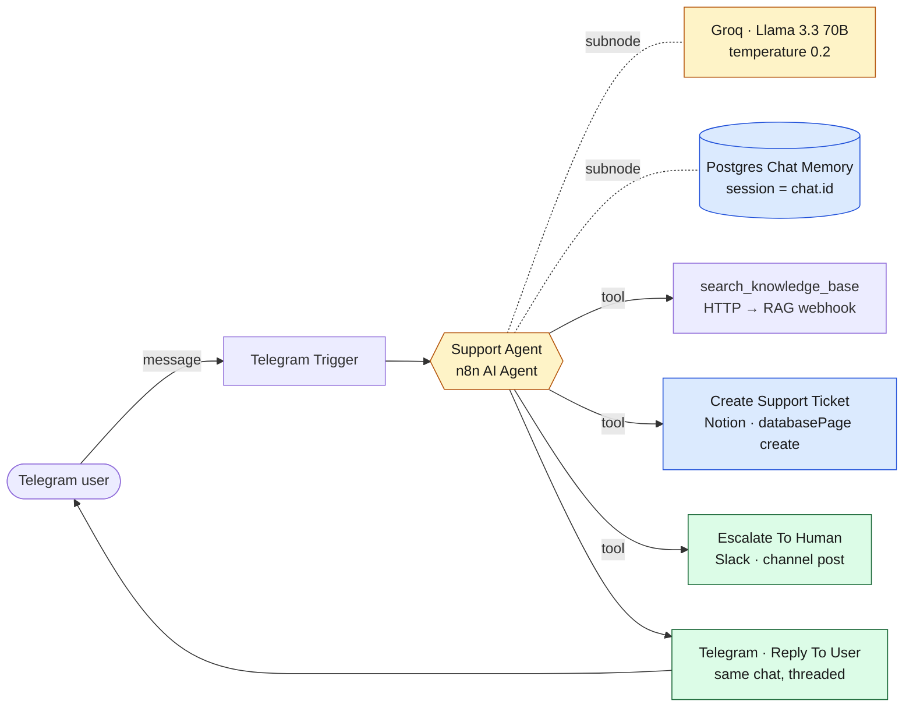

# AI Support Agent — Telegram

A Telegram bot that answers support questions out of your own docs, opens tickets in Notion when it can't, and pages a human in Slack when it must. Built around the n8n **AI Agent** node with three first-class tools and Postgres-backed conversation memory keyed by Telegram chat ID.

> **Status:** Production-shaped reference workflow. Imports cleanly into any n8n instance. Bring your own Telegram / Groq / Postgres / Notion / Slack credentials, plus an existing RAG webhook (or stub one for the demo).

---

## Architecture

---

## What it does

### 1. Trigger
**Telegram Trigger** listens for `message` updates on the bot. Every inbound user message hits the agent.

### 2. Decide
**Support Agent** (n8n AI Agent, Groq Llama-3.3-70B at `temperature: 0.2`) reads the message plus the last 10 turns from Postgres memory and decides — using the system prompt as a policy — which tool, if any, to call:

- **`search_knowledge_base`** — ALWAYS first for product/policy/how-to questions. Calls the existing RAG workflow over HTTP and grounds the reply in the returned passage.
- **`Create Support Ticket`** — when the user reports a bug, billing issue, or account problem the KB can't solve. Writes to a Notion DB with status, priority, user, and summary.
- **`Escalate To Human`** — when the user explicitly asks for a human, is angry, or the issue is urgent (outage, data loss, payment failure). Pings the on-call Slack channel.

The agent can chain tools (e.g. KB → can't find → create ticket) within `maxIterations: 6`.

### 3. Reply
**Reply To User** sends the agent's final text back to the originating chat, replying to the original message for thread cohesion. `appendAttribution: false` keeps the "sent with n8n" footer off.

### 4. Remember
**Conversation Memory** stores the running history in Postgres, keyed by `message.chat.id` so each user gets their own context. Table `support_agent_memory` is auto-created on first run.

---

## Why these design choices

- **Tools, not prompts** — instead of stuffing instructions into a giant prompt and hoping, each capability is a real n8n node the agent invokes. Easier to debug, audit, and extend.
- **RAG as a tool** — reuses the existing `RAG — Query` workflow over HTTP rather than duplicating embedding + vector logic. Composition over duplication.
- **Postgres memory keyed by chat.id** — same DB as RAG, no new infra, naturally per-user.
- **`temperature: 0.2`** — agents that route to tools want determinism, not creativity.
- **`$fromAI` placeholders** — Notion fields (summary, priority, details) and the Slack alert text are filled by the LLM at tool-call time, not by hardcoded expressions, so the agent decides priority + phrasing.
- **Telegram over WhatsApp** — bot creation is 30 seconds via BotFather; no Meta Business approval, no phone verification.

---

## Tool contracts

### `search_knowledge_base`
- **Method:** `POST` to `https://<your-n8n>/webhook/rag-query`
- **Body:** `{ "query": "<reformulated user question>" }`
- **Expected response:** synchronous JSON with the answer or context passage
- **Note:** the existing `RAG — Query` workflow is wired to a Slack slash command (async via `response_url`). For this agent you need a parallel **synchronous** webhook variant that returns the answer directly. See *Setup* below.

### `Create Support Ticket` → Notion
Creates one row in the **Support Tickets** database with:
| Property | Type | Source |
| --- | --- | --- |
| (title) | title | LLM-generated summary, ≤80 chars |
| Status | status | hardcoded `Open` |
| Priority | select | LLM-chosen `Low` \| `Medium` \| `High` |
| User | rich_text | Telegram username or first name |
| Summary | rich_text | LLM-generated details |

### `Escalate To Human` → Slack
Posts a single text message to the configured channel with an LLM-composed alert containing the user identifier and the ask.

---

## Setup

### 1. Create the Telegram bot
1. Open Telegram → message **`@BotFather`**
2. `/newbot` → name → username (must end in `bot`)
3. Copy the HTTP API token
4. n8n → Credentials → New → **Telegram API** → paste token

### 2. Notion Support Tickets DB
Create a Notion database with these properties:
- (default Title)
- `Status` — Status field (must include an option literally named `Open`)
- `Priority` — Select with options `Low`, `Medium`, `High`
- `User` — Text
- `Summary` — Text

Share the DB with your Notion integration. Copy the database ID (the 32-char string in the URL).

### 3. RAG synchronous webhook
The agent expects a sync `{answer, sources}` JSON response. The shipped `Rag/RAG — Query (HTTP).json` workflow is exactly this — import it, activate it, and the agent's `Search Knowledge Base` tool URL (`/webhook/rag-query`) will resolve. If you'd rather extend the existing Slack-shaped `RAG — Query`, add a second Webhook trigger that bypasses the `response_url` path and feeds a Respond-to-Webhook node returning `{answer, sources}`.

### 4. Slack escalation channel
Create / pick a Slack channel (e.g. `#kb-support`), invite your existing Slack bot, copy the channel ID (`Cxxxxxxxxxx`).

> **Two-way replies:** pair this workflow with [`Slack Telegram Bridge`](../Slack%20Telegram%20Bridge/) — when a human replies in-thread under an escalation post, the bridge forwards that reply back to the original Telegram user. Without it, escalations are one-way.

### 5. Import & wire
1. n8n → Workflows → Import from File → pick `AI Support Agent — Telegram.json`
2. Bind credentials on red-flagged nodes (Telegram, Groq, Postgres, Notion, Slack)
3. Replace the three placeholders inside node parameters:
   - `Search Knowledge Base` → `url` → your sync RAG webhook
   - `Create Support Ticket` → `databaseId.value` → your Notion DB id
   - `Escalate To Human` → `channelId.value` → your Slack channel id
4. Activate

### 6. Test
In Telegram, search your bot username, hit Start, send:
- A KB question (e.g. "How do I reset my password?") — agent should call `search_knowledge_base` and reply grounded in your docs.
- A bug report (e.g. "I can't log in, payment failed yesterday") — agent should call `Create Support Ticket`.
- An emergency (e.g. "Our data is gone, I need someone now") — agent should call `Escalate To Human`.

---

## Configuration reference

### Credentials needed
| Credential | Used by |
| --- | --- |
| Telegram API | Telegram Trigger, Reply To User |
| Groq API | Groq Llama 3.3 70B (model subnode) |
| Postgres | Conversation Memory |
| Notion API | Create Support Ticket |
| Slack API (Bot Token) | Escalate To Human |

### Hardcoded values to swap
| Where | Placeholder | Replace with |
| --- | --- | --- |
| `Search Knowledge Base` → `url` | `https://YOUR_N8N_HOST/webhook/rag-query` | your sync RAG webhook URL |
| `Create Support Ticket` → `databaseId.value` | `YOUR_NOTION_DATABASE_ID` | Notion Support Tickets DB id |
| `Escalate To Human` → `channelId.value` | `YOUR_SLACK_CHANNEL_ID` | Slack channel id (`Cxxxxxxxxxx`) |

### Memory table
- **Name:** `support_agent_memory`
- **Sessions:** keyed by Telegram `chat.id`
- **Window:** 10 turns
- Table is auto-created by the Postgres Chat Memory node on first run.

---

## Sanitized for sharing

Tokens, channel IDs, and database IDs are replaced with `YOUR_*` placeholders. Credential IDs in the JSON are also placeholders — n8n will prompt for binding on import. Nothing here will leak into your n8n if you forget to swap a value; it just won't run.

---

## Stack

| Layer | Tool |
| --- | --- |
| Orchestration | n8n |
| Agent runtime | `@n8n/n8n-nodes-langchain.agent` v3.1 |
| LLM | Groq — Llama 3.3 70B |
| Memory | PostgreSQL (Postgres Chat Memory subnode) |
| Knowledge base | Existing RAG workflow over HTTP |
| Ticketing | Notion — `databasePage` create |
| Escalation | Slack — `message` post |
| Inbound channel | Telegram Bot API |
