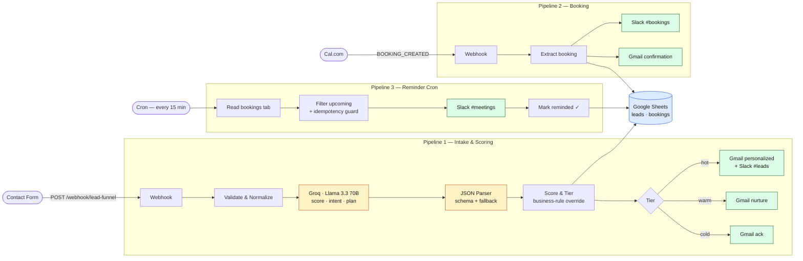

# Lead Funnel — B2B Portfolio

A single n8n workflow containing **three coordinated pipelines** that turn a portfolio contact form into an end-to-end lead funnel: AI-scored intake, Cal.com booking capture, and a 15-minute reminder cron — all writing to the same Google Sheet as a lightweight CRM.

> **Status:** Live on the personal portfolio at [andrei.figliounicotech.online](https://andrei.figliounicotech.online). Real submissions hit the workflow.

---

## Architecture



---

## What it does

### Pipeline 1 — Intake & Scoring (`POST /webhook/lead-funnel`)
1. **Lead Webhook** receives the form submission (name, email, company, role, message, inquiry type, budget range)
2. **Validate & Normalize** rejects requests missing `name` or `email`; trims and lowercases everything else
3. **Groq AI Enrichment** (Llama 3.3 70B) scores the lead 1–10, extracts an intent (`demo_request | pricing_inquiry | general_question | partnership`), writes a one-sentence problem statement, and proposes a 3–4 step n8n automation plan tailored to the lead's stated need
4. **Lead JSON Parser** (LangChain structured output) enforces the response schema — malformed AI output falls back to a default
5. **Parse & Score Lead** applies a business rule: certain inquiry types (`ai-automation`, `complex-automation`, `web-dev`) get a minimum score of 8 regardless of AI verdict. Final score → tier (`hot` ≥8, `warm` 5–7, `cold` ≤4)
6. **Log to Google Sheets** appends a row to the leads sheet (lightweight CRM)
7. **Tier Switch** routes to:
   - **Hot:** personalized Gmail + instant Slack alert to `#leads`
   - **Warm:** value-focused Gmail nurture
   - **Cold:** lightweight Gmail acknowledgement

### Pipeline 2 — Cal.com Booking (`POST /webhook/cal-booking`)
1. **Cal.com Booking Trigger** receives Cal.com's webhook payload when a meeting is booked
2. **Extract Booking Data** flattens Cal.com's nested payload into flat fields
3. **Slack — #bookings** posts the booking summary to the team channel
4. **Append Booking to Sheets** logs the booking to a separate Sheets tab
5. **Email — Booking Confirmation** sends a confirmation Gmail to the attendee

### Pipeline 3 — Meeting Reminders (cron, every 15 minutes)
1. **Schedule — Every 15 Min** fires the cron
2. **Read Bookings Sheet** pulls the bookings tab via the Sheets HTTP API
3. **Filter Upcoming Bookings** keeps rows where `start_time` falls inside the next reminder window AND `reminded` is empty (idempotency guard — prevents duplicate alerts under retries)
4. **Slack — #meetings** alerts the team
5. **Mark Reminded** writes back to the Sheets row to set `reminded = true` so the next cron tick won't re-fire

---

## Architecture

```
                ┌─────────────────────────────────────────┐
   POST  ─────► │           Pipeline 1: INTAKE            │
 /lead-funnel   │                                         │
                │  Webhook → Validate → Groq Enrichment   │
                │     → JSON Parser → Score & Tier        │
                │     → Sheets (leads) → Switch           │
                │           ├─ Hot:  Gmail + Slack        │
                │           ├─ Warm: Gmail                │
                │           └─ Cold: Gmail                │
                └─────────────────────────────────────────┘

                ┌─────────────────────────────────────────┐
   POST  ─────► │       Pipeline 2: CAL.COM BOOKING       │
 /cal-booking   │                                         │
                │  Webhook → Extract → Slack(#bookings)   │
                │     → Sheets(bookings) → Gmail confirm  │
                └─────────────────────────────────────────┘

                ┌─────────────────────────────────────────┐
  cron */15  ─► │     Pipeline 3: 15-MIN REMINDER         │
                │                                         │
                │  Schedule → Sheets API GET → Filter     │
                │     (idempotency guard) → Slack         │
                │     → Sheets API PATCH (mark reminded)  │
                └─────────────────────────────────────────┘
```

---

## Setup

### 1. Required credentials (recreate in your n8n)

| Credential name in workflow | Type | Used by |
| --- | --- | --- |
| `Groq account` | Groq API | AI enrichment |
| `Google Sheets account` | Google Sheets OAuth2 / Service Account | Sheets append + HTTP requests |
| `Gmail account` | Gmail OAuth2 | All outbound email |
| `Lead Funnel` (Slack) | Slack OAuth2 / Bot | Slack alerts to `#leads`, `#bookings`, `#meetings` |

### 2. External resources you'll need

- A Google Sheet with two tabs: `Sheet1` (leads) and a bookings tab. Column headers should match the field mappings inside the Sheets nodes — open the workflow to see the exact column names.
- A Slack workspace with channels `#leads`, `#bookings`, `#meetings` and the bot installed
- A Cal.com account with a webhook configured to fire `BOOKING_CREATED` to `https://<your-n8n>/webhook/cal-booking`
- A Groq account ([console.groq.com](https://console.groq.com))

### 3. Replace the hardcoded Sheet ID

Open the workflow JSON and search for `documentId` — replace the placeholder with **your own** Google Sheet ID before activating.

### 4. Import & activate

1. n8n → Workflows → **Import from File** → select `Lead Funnel — B2B Portfolio.json`
2. Open each red-flagged node and bind the credential you created
3. Activate the workflow

---

## Test it

### Pipeline 1 — Intake

```bash
curl -X POST https://<your-n8n>/webhook/lead-funnel \
  -H 'Content-Type: application/json' \
  -d '{
    "name": "Jane Smith",
    "email": "jane@acme.com",
    "company": "Acme Co",
    "role": "Head of Operations",
    "inquiry": "ai-automation",
    "message": "We have 200+ inbound leads/week and need scoring + routing. Budget exists.",
    "budget_range": "$2k-5k"
  }'
```

Expected: row appended to leads sheet, hot-tier Gmail to Jane, Slack alert to `#leads`.

### Pipeline 3 — Reminders

Add a row to the bookings tab with `start_time` set ~10 minutes in the future and `reminded` empty. Within 15 minutes, a Slack alert should fire and the `reminded` cell should flip to `true`. The next cron tick will skip the row.

---

## Design notes

- **Idempotency on the reminder cron** — the `reminded` flag is the cheapest possible deduplication. No external state store needed; the Sheet itself is the source of truth.
- **Business-rule override on AI scoring** — the `pricingInquiries` minimum-score floor in `Parse & Score Lead` exists because the AI tends to under-score qualified-but-curt messages from technical buyers. Cheap, robust override.
- **Defensive AI parsing** — `Lead JSON Parser` enforces a schema, but `Parse & Score Lead` *also* falls back to defaults if `$json.output` is missing entirely. AI nodes fail in surprising ways; both layers are needed.
- **Three pipelines in one workflow** — kept together because they share one credentials set and one Sheet. Splitting would multiply config without separating concerns.

---

## Files

- `Lead Funnel — B2B Portfolio.json` — exported workflow, importable into any n8n instance
