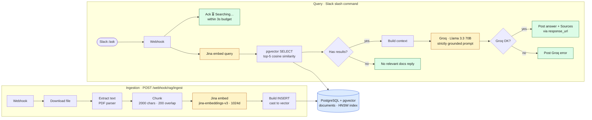

# RAG — Document Intelligence

Two coordinated n8n workflows that turn any document corpus into a Slack-queryable knowledge base. Embeds with **Jina AI**, stores vectors in **PostgreSQL + pgvector**, and answers questions with **Groq (Llama 3.3 70B)** grounded strictly in retrieved context.

---

## Architecture



---

## What it does

This folder ships **four** workflows — the two original Slack-shaped ones plus two extras:

| File | Trigger | Purpose |
| --- | --- | --- |
| `RAG — Ingestion.json` | HTTP webhook | Ingest a single file by URL |
| `RAG — Slack Channel Ingestion.json` | Slack Events (`#rag-docs`) | Drop a link in a channel → auto-ingest |
| `RAG — Query.json` | HTTP webhook (Slack-shaped) | Slack slash command, async via `response_url` |
| `RAG — Query (HTTP).json` | HTTP webhook (sync) | Programmatic API: `POST /webhook/rag-query` → `{answer, sources}` — used as a tool by the AI Support Agent |

---

### `RAG — Ingestion.json` — Ingestion (`POST /webhook/rag/ingest`)

```
Webhook → Download File → Extract Text → Chunk
       → Jina Embed → Prepare Insert → Postgres INSERT
       → Aggregate → Respond
```

1. **Ingest Webhook** receives `{ file_url, source_name, source_url }`
2. **Download File** pulls the file (PDF, etc.) as binary
3. **Extract Text** uses n8n's PDF extractor
4. **Chunk Text** — 2000-char chunks, 200-char overlap, 1600-char hard cap, drops chunks <20 chars. Throws if the document produces zero usable chunks
5. **Jina Embed** calls `jina-embeddings-v3` at 1024 dimensions, batched 1 req per chunk with 500 ms throttle
6. **Prepare Insert** builds an escaped `INSERT` statement per chunk, casting the embedding to `vector`
7. **Insert Document** writes to the `documents` table in PostgreSQL
8. **Aggregate** + **Respond** — returns `{ ok: true, source_name, chunks_ingested }`

### `RAG — Query.json` — Query (`POST /webhook/rag/ask`)

Designed to be triggered from **Slack** (slash command or message URL). Uses Slack's `response_url` deferred-response pattern — the webhook acks immediately and posts the real answer asynchronously.

```
Webhook → Respond ACK ("Searching…") → Jina Embed Query
       → Prepare Vector SQL → pgvector SELECT (top 5)
       → Collect Results → Has Results? ──┐
                                          ├─ yes → Build Context → Groq LLM
                                          │       → Groq OK? ──┐
                                          │                    ├─ yes → Post Answer to Slack
                                          │                    └─ no  → Post Groq Error
                                          └─ no  → "No relevant docs" reply
```

Key behaviors:
- **Immediate ack** to Slack, then async heavy lifting
- **Top-5 cosine similarity** retrieval via `embedding <=> $query::vector` (pgvector default operator)
- **Strictly grounded prompt** — system message tells Groq to answer **only** from provided context and to cite sources at the bottom
- **Three failure modes handled distinctly:** no results, Groq API error, normal answer
- **Retry policy** on Groq node: 2 attempts, 2s backoff, `continueOnFail` so error-path nodes can run

---

## Setup

### 1. PostgreSQL with pgvector

```sql
CREATE EXTENSION IF NOT EXISTS vector;

CREATE TABLE documents (
  id           BIGSERIAL PRIMARY KEY,
  content      TEXT NOT NULL,
  embedding    VECTOR(1024) NOT NULL,
  source_name  TEXT,
  source_url   TEXT,
  chunk_index  INT,
  created_at   TIMESTAMPTZ DEFAULT now()
);

-- Approximate nearest-neighbor index (HNSW recommended for read-heavy)
CREATE INDEX ON documents USING hnsw (embedding vector_cosine_ops);
```

### 2. Required credentials (recreate in your n8n)

| Credential name | Type | Used by |
| --- | --- | --- |
| `Jina AI` | HTTP Header Auth — `Authorization: Bearer <jina-key>` | Both workflows (embeddings) |
| `PostgreSQL RAG` | Postgres | Both workflows |
| `Groq API` | HTTP Header Auth — `Authorization: Bearer <groq-key>` | Query workflow only |

### 3. Import both workflows

1. n8n → Import → `RAG — Ingestion.json`, then `RAG — Query.json`
2. Bind credentials on each red-flagged node
3. Activate both

---

## Test it

### Ingest a PDF

```bash
curl -X POST https://<your-n8n>/webhook/rag/ingest \
  -H 'Content-Type: application/json' \
  -d '{
    "file_url":   "https://example.com/whitepaper.pdf",
    "source_name": "Acme 2026 Whitepaper",
    "source_url":  "https://example.com/whitepaper.pdf"
  }'
```

Expected: `{ "ok": true, "source_name": "...", "chunks_ingested": 47 }`

### Ask a question (Slack-shaped payload)

```bash
curl -X POST https://<your-n8n>/webhook/rag/ask \
  -H 'Content-Type: application/json' \
  -d '{
    "text":         "What does Acme say about pricing?",
    "user_name":    "andrei",
    "response_url": "https://hooks.slack.com/commands/T.../..."
  }'
```

Expected: immediate `"⏳ Searching knowledge base..."` ephemeral ack to the caller; an in-channel Slack post (via `response_url`) with the grounded answer plus a `Sources:` footer ~2–4 seconds later.

### Wire it to a Slack slash command

Create a slash command (e.g. `/ask`) pointing to `https://<your-n8n>/webhook/rag/ask`. Slack will inject `text`, `user_name`, and `response_url` automatically.

---

## Design notes

- **Why pgvector and not a dedicated vector DB?** One database for content + vectors + audit metadata. Simpler ops, single backup, no cross-store consistency issues. HNSW gives sub-100ms retrieval at the corpus sizes I'm working with.
- **Why 2000/200 chunking?** Empirical sweet spot for the corpora I tested — large enough to keep paragraphs intact, overlap large enough to keep cross-chunk references retrievable. Easy to retune in the Code node.
- **Why ack-then-answer?** Slack slash commands have a 3-second response budget. Embedding + retrieval + LLM generation typically takes 2–4 seconds. The ack pattern lets us stay within budget while still doing real work.
- **Why `continueOnFail` on Groq?** So the `Groq OK?` IF node downstream can branch on whether the LLM call actually succeeded, rather than the whole workflow erroring out and losing the user's question.

---

## Future improvements (intentionally not done yet)

- **Parameterized SQL** — current implementation string-escapes single quotes before interpolation. Functional but should move to Postgres node's `queryParams` for production hardening.
- **Reranking** — top-5 cosine retrieval works for most queries; a cross-encoder reranker would lift answer quality on ambiguous questions.
- **Per-source ACLs** — `documents` is currently a flat namespace. A `tenant_id` column + filter in the SELECT would make this multi-tenant.

---

### `RAG — Slack Channel Ingestion.json` — Slack-driven ingest

Listens on Slack Events for messages in `#rag-docs`. When a user drops a URL in that channel:
1. Slack URL-verification challenge is handled inline (returns the `challenge` value).
2. Ack 200 immediately, then extract the first URL from the message text.
3. POST it to `RAG — Ingestion`'s `/webhook/rag/ingest` endpoint with that URL as `file_url`.
4. Reply in-thread on success / failure; DM the maintainer on hard errors.

Setup: create a Slack app with the **Events API** subscribed to `message.channels`, point the request URL at this workflow's webhook, and invite the bot to `#rag-docs`.

### `RAG — Query (HTTP).json` — Synchronous JSON API

Same retrieval + Groq pipeline as `RAG — Query.json`, but with no Slack-specific plumbing — the webhook responds synchronously with:

```json
{ "answer": "...", "sources": ["source_name", "..."] }
```

This is the variant the **AI Support Agent** calls as a tool (`POST /webhook/rag-query`). Drop it in if you want to consume RAG from anything that isn't a Slack slash command.

---

## Files

- `RAG — Ingestion.json` — single-file ingestion via HTTP
- `RAG — Slack Channel Ingestion.json` — `#rag-docs` channel listener that calls ingestion
- `RAG — Query.json` — Slack slash-command query (async via `response_url`)
- `RAG — Query (HTTP).json` — synchronous JSON query API (used by AI Support Agent)
