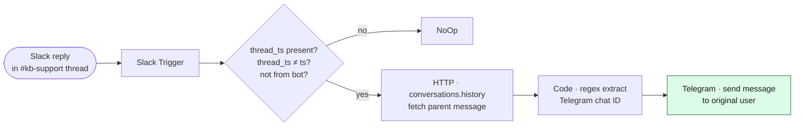

# Slack → Telegram Bridge

The other half of the [AI Support Agent](../AI%20Support%20Agent/) escalation loop. When a human replies in a Slack thread under an escalation post, this workflow forwards that reply back to the original Telegram user — turning one-shot escalations into real two-way conversations.

---

## Architecture

---

## How it works

1. **Slack Trigger** subscribes to `message` events in `#kb-support`.
2. **`Is Human Thread Reply?`** filters out the noise — only reply messages (`thread_ts` set and ≠ `ts`) authored by humans (`bot_id` empty).
3. **`Fetch Parent Message`** calls `conversations.history` with `latest=thread_ts` + `inclusive=true` + `limit=1` to get the original escalation message text.
4. **`Extract Chat ID`** (Code node) regex-matches `Telegram chat ID:` `<digits>`` from the parent — the AI Support Agent stamps every escalation with this exact line.
5. **`Send To Telegram`** posts the human's reply text to that chat ID, prefixed with `👤 *Support team reply:*`.

If the regex doesn't match (parent isn't an escalation post), the Code node returns `[]` and the run ends silently.

---

## Why this design

- **No state store.** The Telegram chat ID lives in the parent Slack message itself — the AI Support Agent stamps it there explicitly. Bridging is one Slack API call + a regex.
- **Filter at the IF, not the trigger.** Slack's `messages` channel-trigger fires on every event in the channel including bot self-replies and edits. The IF gate keeps only "human, in a thread."
- **Markdown-passthrough.** Forwarded text is sent with `parse_mode: Markdown` so support engineers can format inline (bold, code, links).

---

## Setup

### 1. Slack credential
Reuse the existing Slack bot credential from the AI Support Agent — needs `channels:history` (to fetch the parent) plus the standard `chat:write` for the trigger.

### 2. Channel
The trigger is bound to `#kb-support` by name. Change in the Slack Trigger node if you escalate to a different channel.

### 3. Telegram credential
Reuse the same Telegram Bot API credential as the AI Support Agent — replies must come from the same bot the user is already DMing.

### 4. Import + activate
1. n8n → Import → `Slack — Telegram Bridge.json`
2. Bind Slack and Telegram credentials on red-flagged nodes
3. Activate

---

## Test

1. Trigger an escalation from Telegram (e.g. tell the bot "I need a real human, this is urgent").
2. Confirm the AI Support Agent posts to `#kb-support` with a `Telegram chat ID:` line.
3. Reply in that Slack thread.
4. Confirm the user receives `👤 Support team reply: <your reply>` on Telegram.

---

## Files

- `Slack — Telegram Bridge.json` — exported workflow
