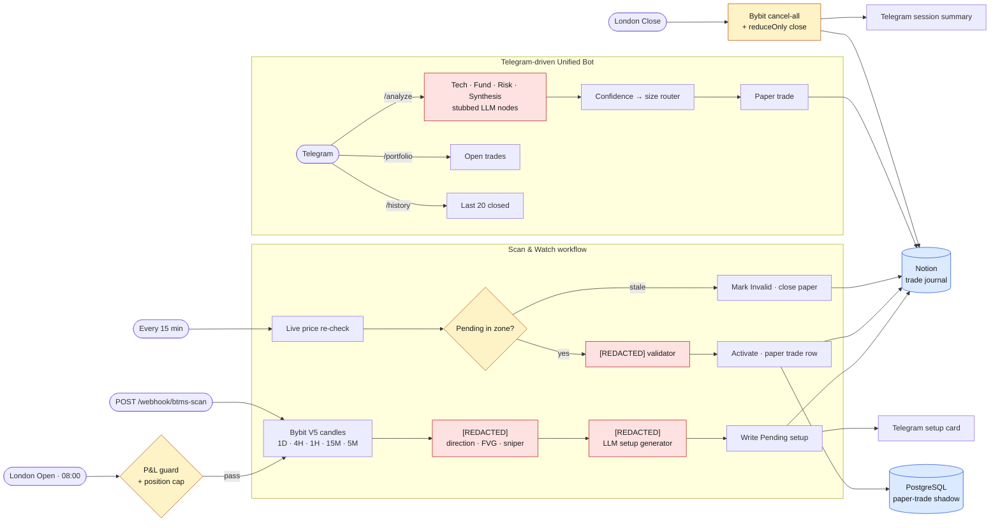

# BTMS — Trading Operations Framework

Two coordinated n8n workflows that wrap a trading strategy in everything around it: scanning, scheduling, execution, paper-trade logging, Notion-based trade journaling, Telegram alerts, and session-end auto-close.

> **The strategy itself is intentionally redacted in this public copy.** Strategy nodes (Elliott Wave detection, FVG zones, confluence scoring, position sizing, LLM prompts) have been replaced with stub Code nodes that pass input through. **What you see is the operational scaffolding** — drop your own setup detection in and the rest works.

> **Live status:** Runs on demo Bybit + a private Notion workspace. Not investment advice — published as a portfolio piece showing how to wrap a strategy in production-grade ops.

---

## Why this is interesting

Most "trading bot" repos publish the strategy and skip the operational ugly bits — session boundaries, idempotency, paper-trade replay, journaling, alerts, kill switches. **This repo is the inverse.** The strategy is a black box; what's exposed is everything you'd need around *any* strategy to make it operable.

If you're hiring an automation engineer, this is the part that takes 80% of the time and 0% of the YouTube views.

---

## Architecture



---

## What's inside

### `BTMS — Scan & Watch.json` — the scanner / setup tracker
Cron-driven multi-timeframe scanner. Detects setups, writes them to Notion with `Status=Pending`, then on each tick checks live price against pending setups and either activates them (within entry zone) or invalidates them (price ran away).

```
Triggers:
  ├── London Open Cron (08:00 weekdays)        → full multi-TF scan
  ├── Every 15M Cron (08-16 weekdays)          → live price re-check vs pending Notion setups
  └── /webhook/btms-scan                        → manual scan trigger

Pipeline:
  1D / 4H / 1H / 15M / 5M candles (Bybit V5)
   → [REDACTED] direction agent (was: Elliott Wave / multi-TF bias)
   → [REDACTED] FVG zone finder + sniper entry checker
   → [REDACTED] LLM setup generator
   → Notion: write Pending setup
   → Telegram: post setup card

Watch loop (every 15 min):
   Live price → query Notion Pending setups
   → if price inside entry zone → [REDACTED] validation agent → activate + paper-trade DB row
   → if price out of bounds     → mark Invalid + close paper trade
```

### `BTMS — Unified Bot.json` — Telegram-driven trader + session manager
A Telegram bot that responds to commands AND auto-runs at session boundaries.

```
Telegram commands:
  /analyze <SYMBOL>   → tech + fundamental + risk → synthesised signal → paper trade
  /portfolio           → snapshot of open Notion trades
  /history             → last 20 closed trades from Notion
  /help                → command list

Session triggers:
  London Open  → daily P&L guard + open-position guard → if green, fire scan
  London Close → force-close every open Bybit position → close Notion trades
                 → post session summary to Telegram
```

The four LLM analysis nodes (`Tech`, `Fund`, `Risk`, `Synthesis`) are present but their prompts and parsers are stubbed — replace with whatever model and prompt schema you prefer.

---

## Architectural decisions worth borrowing

| Pattern | Why it matters |
| --- | --- |
| **Two-stage setup state** (Pending → Active/Invalid in Notion) | A scan and a fill aren't the same event. Pending lets you re-validate against live price every 15 min without re-scanning every TF. |
| **Notion as the trade journal** | Free, queryable from any node, has a UI, gives you charts/filters for free. Replaces a custom dashboard. |
| **Paper-trade DB shadow** (`Postgres: Close Paper Trade`) | Every Notion mutation is mirrored to Postgres so you can replay/backtest the operational layer without touching exchange. |
| **Session guards** (P&L cap + open-position cap) | Daily-loss-limit and "don't open new trades while N positions already open" enforced before the strategy even runs. |
| **Force-close at London Close** | Calls Bybit `/v5/order/cancel-all` then `/v5/order/create` with `reduceOnly` for every open position. Guarantees no overnight surprises if the strategy forgot to exit. |
| **Confidence → size router** | Position size is a function of strategy confidence, not a constant. The router node maps confidence buckets to risk pct. |
| **Telegram is the UI** | No frontend to maintain. Every state transition fires a Telegram message; user input comes back through the bot trigger. |

---

## What's stubbed (and what to put back)

| Node name | What was redacted | What to drop in |
| --- | --- | --- |
| `EW Direction Agent`, `Setup Generator`, `Validation Agent` | LLM HTTP calls with proprietary prompts on Bybit candle data | Any LLM endpoint of your choice. URL is `https://your-strategy-endpoint.example.com/analyze`. |
| `FVG Zone Finder`, `Sniper Entry Checker` | JS that scans candle sequences for fair-value-gap patterns + 5-min entry triggers | Your own setup detection. Output shape expected: `{ direction, entry_low, entry_high, stop_loss, tp1, tp2, confidence, fvg_description, ew_context }` |
| `Format Tech Prompt`, `Format Fund Prompt`, `Build Risk Query`, `Build Synthesis` | LLM prompt builders for `/analyze` command | Your prompt templates. Each consumes `$json` from upstream and produces `{ prompt: "..." }`. |
| `Confidence → Size Router` | Maps `confidence` (0-100) → `positionSizePct` | A function of your risk model. |
| `Execute Trade`, `Execute Scan Trade` | Calls Bybit V5 with HMAC signing, places market entries with `reduceOnly` close logic | Same Bybit signing pattern is shown in `Force Close Positions` — copy that and adapt. |

---

## Setup

### 1. Environment variables (set on the n8n host)

```bash
NOTION_TOKEN=ntn_xxx                    # Notion integration token
NOTION_SETUPS_DB_ID=xxxxxxxx-xxxx...   # database for Pending/Active/Invalid setups
NOTION_TRADES_DB_ID=xxxxxxxx-xxxx...   # database for paper trades + closed trades
BYBIT_API_KEY=xxx                       # Bybit demo or live, your call
BYBIT_API_SECRET=xxx
LLM_API_KEY=sk-xxx                      # whichever provider your strategy nodes hit
BTMS_TELEGRAM_CHAT_ID=xxxxxxxxx         # the chat/user ID that receives session + setup alerts
```

> All hardcoded IDs have been stripped from the JSON. The Telegram nodes in `Scan & Watch` read `BTMS_TELEGRAM_CHAT_ID` from env — set it on your n8n host before activating the workflow, or replace the expression with a literal in each Telegram node.

### 2. Notion databases (two of them)

**Setups DB** (used by `Scan & Watch`):

| Property | Type |
| --- | --- |
| Name | Title |
| Direction | Select (LONG / SHORT) |
| Entry Low | Number |
| Entry High | Number |
| Stop Loss | Number |
| Take Profit 1 | Number |
| Take Profit 2 | Number |
| Entry TF | Select (1H / 15M / 5M) |
| FVG Description | Rich text |
| Elliott Wave Context | Rich text |
| Confidence | Number |
| Status | Select (Pending / Active / Invalid) |
| Scan Time | Date |

**Trades DB** (used by both workflows):

| Property | Type |
| --- | --- |
| Trade Name | Title |
| Symbol | Rich text |
| Side | Select (LONG / SHORT) |
| Status | Select (OPEN / CLOSED) |
| Entry / Stop Loss / Take Profit / Close Price | Number |
| Risk Pct / Stop Loss Pct / Confidence / PnL Pct / RR Achieved | Number |
| Open Time / Close Time | Date |
| Notes | Rich text |

Share both databases with your Notion integration before running.

### 3. n8n credentials to recreate

| Credential name | Type |
| --- | --- |
| `BTMS Telegram Bot` | Telegram |
| `Postgres BTMS` | Postgres (paper-trade shadow) |
| `Anthropic API` (or your LLM of choice) | HTTP Header Auth |

### 4. Postgres (paper-trade shadow)

```sql
CREATE TABLE paper_trades (
  id            BIGSERIAL PRIMARY KEY,
  trade_name    TEXT NOT NULL,
  symbol        TEXT NOT NULL,
  side          TEXT NOT NULL,
  entry         NUMERIC,
  stop_loss     NUMERIC,
  take_profit   NUMERIC,
  status        TEXT DEFAULT 'OPEN',
  open_time     TIMESTAMPTZ DEFAULT now(),
  close_time    TIMESTAMPTZ,
  pnl_pct       NUMERIC,
  notion_page_id TEXT
);
```

### 5. Import & wire

1. n8n → Workflows → Import from File → both `.json` files
2. Open every red-flagged node and bind your credentials (every `credentials.*.id` in the JSON is a placeholder `YOUR_CREDENTIAL_ID` — n8n will prompt you to pick the real credential on import)
3. Set the env vars listed above on your n8n host (`NOTION_TOKEN`, `NOTION_*_DB_ID`, `BYBIT_*`, `LLM_API_KEY`, `BTMS_TELEGRAM_CHAT_ID`)
4. Replace strategy stubs with your own (see "What's stubbed" table)
5. Activate both workflows

---

## Manual test

```bash
# Trigger a scan from outside n8n
curl -X POST https://<your-n8n>/webhook/btms-scan

# Or DM your Telegram bot
/analyze BTCUSDT
/portfolio
/history
```

---

## Files

- `BTMS — Scan & Watch.json` — scanner + 15-min watch loop
- `BTMS — Unified Bot.json` — Telegram bot + session manager
- `README.md` — this file
